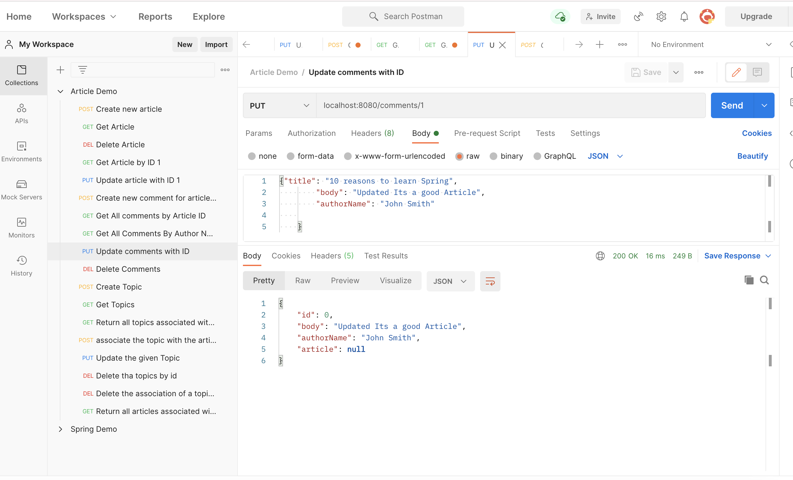

# Dev News 

## Introduction
This Application is all about building the backend API for a developer news site where 
users can create articles,retrieve the list of Articles,update articles,delete Articles.
The user can create new comments ,update comments,retrieve the comments
made by author given by authorName,retrieve comments on article given by articleId,
delete the comments.
The user can also create topics to the Articles,retrieve all the topics,retrieve 
all the topics associated with article given by articleId,associate the topic with the article given by 
articleId,update the given topic,delete the given topic,retrieve all articles associated with 
the topic given by topicId.

It doesn't require a graphical user interface. The User can make the requests and get plain json text responses via 
curl/Postman.

## Getting Started
The application can run directly via Gradle. The code for this application uses the Gradle build tool (https://gradle.org.). Instructions for 
installing Gradle are available in the official documentation(https://gradle.org/install) 
which describes several options.

## How to Run the Application
The application can also be run via terminal with the Gradle.

```
./gradlew bootRun
```
To Stop Running the Application:

```
Crtl + C
```
## Setup
We need to configure the following dependencies in `build.gradle`:
* Spring Web
* Spring JPA
* PostgreSQL Driver

```Depencies:
plugins {
    id 'org.springframework.boot' version '2.4.4'
    id 'io.spring.dependency-management' version '1.0.11.RELEASE'
    id 'java'
}

repositories {
    mavenCentral()
}

dependencies {
    implementation 'org.springframework.boot:spring-boot-starter-web'
    runtimeOnly 'org.postgresql:postgresql'
    implementation 'org.springframework.boot:spring-boot-starter-validation'
    implementation 'org.springframework.boot:spring-boot-starter-data-jpa'

}
```

`src/main/resources/application.properties` should be configured:
```properties
spring.jpa.database=POSTGRESQL
spring.jpa.show-sql=true

spring.datasource.url=jdbc:postgresql://localhost:5431/demo
spring.datasource.username=demo_user
spring.datasource.password=demo_pass

spring.jpa.generate-ddl=true
spring.jpa.hibernate.ddl-auto=create
```
## DataBase Setup
A Dockerized PostgreSQL database:

The docker-compose.yaml is manually created.
To create docker-compose from the terminal ,we need to use the command 
```touch docker-compose.yaml ```

and docker-compose.yaml should contain the following.

## Snippets and Commands
```docker-compose.yaml
version: "3"
services:
  database:
    image: postgres:13-alpine
    environment:
      - POSTGRES_DB=demo
      - POSTGRES_USER=demo_user
      - POSTGRES_PASSWORD=demo_pass
    ports:
      - "5431:5432"
    volumes:
      - db-data:/var/lib/postgresql/data

volumes:
  db-data:
```
## Docker Commands
1.Start container
```
docker-compose up
```
2.Stop container 
```
docker-compose down
```
3.List all Running Containers
```
docker ps
```
4.Enter the Running Container
```
docker-compose exec database /bin/sh
```
5.(psql Commands) While inside a postgres container, enter the postgres database. 
```
psql demo demo_user
```
6.psql Commands (when inside the database)
Connect to DataBase:
```bash
\c
```
7.Show the tables in the database
```bash
\dt
```
8.Show all rows in particular table
```
SELECT * FROM articles;
```

### Articles
Article is the core entity in this project. It represents a news article with a unique **id**, **title**, 
**body** (article text content) and the **authorName**.

Example JSON response when requesting an article:

```json
{
    "id": 1,
    "title": "10 reasons to learn Spring",
    "body": "In this article I'll be listing 10 reasons why you should learn spring and use it in your next project...",
    "authorName": "John Smith"
}
```
With the following endpoints:

| HTTP Method | HTTP Path | Action |
| ------------|-----------|--------|
| `GET`    |  `/articles`     | return all articles. |
| `GET`    | `/articles/{id}` | return a specific article based on the provided id. |
| `POST`   | `/articles`    | create a new article. |
| `PUT`    | `/articles/{id}` | update the given article. |
| `DELETE` | `/articles/{id}` | delete the given article. |

### Comments
The Users are able to comment the different articles with a unique **id**, **body**, **authorName** 
(for the comment), and **article** on which the comment was posted. 

Example JSON response when requesting a comment:


```json
{
    "id": 1,
    "body": "This article is very well written",
    "authorName": "John Smith",
    "article": {
        "id": 1,
        "title": "10 reasons to learn Spring",
        "body": "In this article I'll be listing 10 reasons why you should learn spring and use it in your next project...",
        "authorName": "John Smith"
    }
}

```
With the following endpoints:

| HTTP Method | HTTP Path | Action |
| ------------|-----------|--------|
| `GET`    | `/articles/{articleId}/comments`    | return all comments on article given by `articleId`. |
| `GET`    | `/comments?authorName={authorName}` | return all comments made by author given by `authorName`. |
| `POST`   | `/articles/{articleId}/comments`    | create a new comment on article given by `articleId`. |
| `PUT`    | `/comments/{id}`                    | update the given comment. |
| `DELETE` | `/comments/{id}`                    | delete the given comment. |

### Topics
 Articles are categorized by topics. 

Example JSON response when requesting an article after implementing Topics Model:

```json
{
    "id": 1,
    "title": "10 reasons to learn Spring",
    "body": "In this article I'll be listing 10 reasons why you should learn spring and use it in your next project...",
    "authorName": "John Smith",
    "topics": [
        {
            "id": 1,
            "name": "backend"
        },
        {
            "id": 2,
            "name": "java"
        },
        {
            "id": 3,
            "name": "spring"
        }
    ]
}
```
Endpoints:

| HTTP Method | HTTP Path | Action |
| ------------|-----------|--------|
| `GET`    | `/topics` | return all topics. |
| `GET`    | `/articles/{articleId}/topics` | return all topics associated with article given by `articleId`. |
| `POST`   | `/articles/{articleId}/topics` | associate the topic with the article given by `articleId`. If topic does not already exist, it is created. |
| `POST`   | `/topics` | create a new topic. |
| `PUT`    | `/topics/{id}` | update the given topic. |
| `DELETE` | `/topics/{id}` | delete the given topic. |
| `GET`    | `/topics/{topicId}/articles` | return all articles associated with the topic given by `topicId`. |

## List of Files:
The package se.sdaproject contains domain package,dto package,exception package,repository package,
rest package and services package.
The Package domain contains Article.java,Comment.java,Topic.java (DataBase entities).
The Package dto contains ArticleDTO.java,CommentDTO.java,TopicDTO.java (Data Transfer Objects).
The Package exception contains NotFoundException.java,ResourceNotFoundException.java (exceptions).
The Package repository contains ArticleRepository.java,CommentsRepositories.java,TopicRepository.java 
(interfaces).
The Package rest contains ArticleControllers.java,CommentsController.java,TopicControllers.java 
for handling the incoming request and call another part of the application depending on the request action.
The package services contains ArticleService.java,CommentServices.java,TopicServices.java contains the functionalities.
The App.java contains the main() method.

## ScreenShots (Request and Responses via PostMan)
## Creating New Article


## Get Article


## Get Article By Id


## Update Article


## Delete Article


## Create new Comments for Article


## Get all Comments by Article Id


## Get all Comments by AuthorName


## Update Comments by Id



## Delete Comments


## Create Topics


## Get Topics


## Get All Topics associated with Article given by Article Id


## Associate the topic with Article by Article Id


## Update the given Topic


## Delete the Topic by ID


## Get all the articles associated with Topic given by Topic Id


## DataBase ScreenShots

## Running the Containers and Entering the Postgres DataBase and Connecting to DB to view the DB tables.


## To view all the rows in the particular table (articles,comments,topics)


